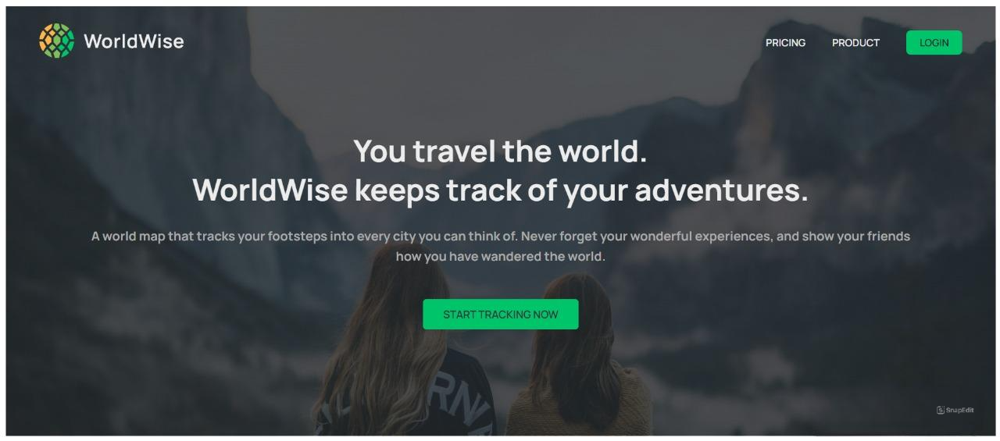
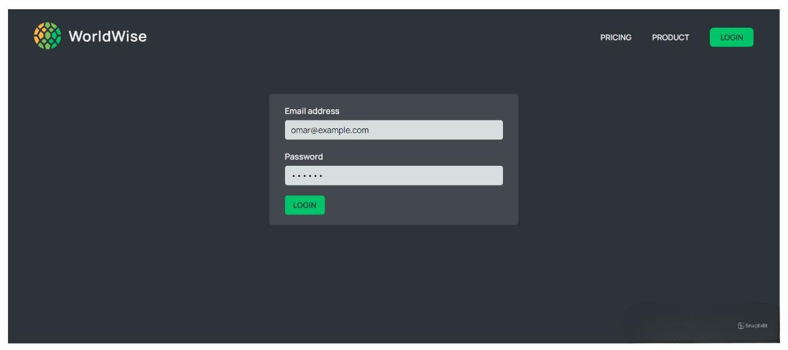
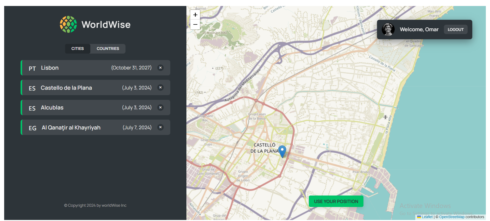

# World Wise

World Wise is an interactive web application that allows users to explore data about cities and countries around the world. The app features a map where users can click on any location to get detailed information about the selected place, including the option to save favorite locations for easy access.

## Table of Contents

- [Features](#features)
- [Tech Stack](#tech-stack)
- [Usage](#usage)
- [Screenshots](#screenshots)
- [Folder Structure](#folder-structure)
- [Contact](#contact)

## Features

- **Interactive Map**: Click on any city or country to get detailed information.
- **Save Locations**: Save your favorite places for quick access later.
- **Responsive Design**: Optimized for various screen sizes, from mobile to desktop.
- **Authentication**: Secure login system for saving personal preferences.

## Tech Stack

- **Frontend**: ReactJS, CSS Modules
- **State Management**: Context API
- **Routing**: React Router
- **Authentication**: Custom authentication page

## Usage

- **Explore the Map**: Click on different locations on the map to view detailed information about cities or countries.
- **Save Favorites**: Use the save feature to bookmark locations that interest you.
- **Authentication**: Log in to access personalized features and save your preferences.

## Screenshots

Here are some screenshots of the World Wise application:

*Home Page*

*Login Page*

*City Details*

## Folder Structure

- **components/**: Reusable UI components.
- **contexts/**: Context API files for state management.
- **pages/**: Different pages of the application.
- **styles/**: CSS Modules for styling.

## Contact

If you have any questions or feedback, feel free to reach out:

- **Email**: omarmohamed827@gmail.com
- **LinkedIn**: [Omar Mohamed](https://www.linkedin.com/in/omar-mohamed-611773292)
